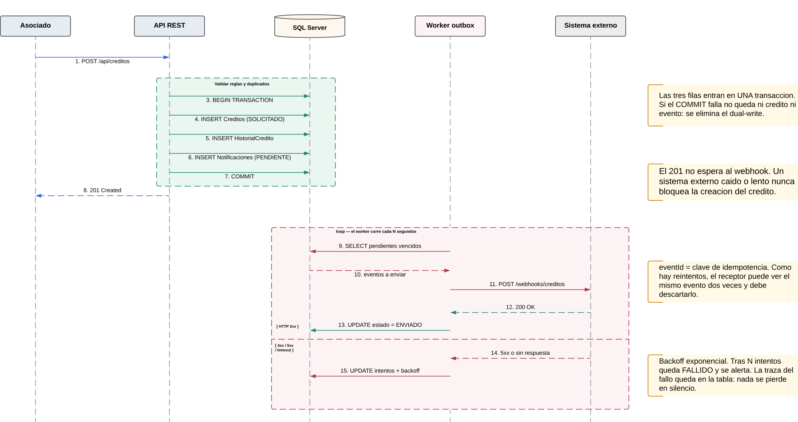

# Módulo de Notificaciones y Webhook

Comunica a sistemas externos los hechos relevantes del ciclo de vida de un crédito, sin que la
disponibilidad de esos sistemas afecte la operación propia.

---

## 1. El problema que resuelve

Cuando se registra un crédito hay que avisar a un sistema externo. La forma directa —llamar al
webhook desde el controlador, justo después de guardar— falla de tres maneras distintas:

| Dónde se pone la llamada HTTP | Qué sale mal |
|---|---|
| Dentro de la transacción | La transacción queda abierta mientras un tercero responde. Un sistema externo lento retiene bloqueos e infla el log de transacciones |
| Después del `COMMIT` | Si el proceso muere entre el `COMMIT` y el envío, existe un crédito que nadie notificó y no queda rastro de que faltó |
| Antes del `COMMIT`, fuera de ella | Se notifica un crédito que puede terminar sin guardarse |

Además, cualquiera de las tres acopla la disponibilidad propia a la del tercero: si el sistema
externo está caído, el asociado no puede registrar su solicitud. Es exactamente lo contrario de
lo que se necesita.

---

## 2. La solución: bandeja de salida transaccional

El evento se **persiste** en la misma transacción que el crédito, y su **entrega** es un problema
separado que resuelve un proceso aparte.



O existen el crédito y su evento, o no existe ninguno de los dos. No hay estado intermedio
posible.

### El evento se genera donde se crea el crédito

La fila de `Notificaciones` la escribe `CreditosService.crear()`, con los datos del crédito que
está insertando. No hay una segunda ruta de creación ni una segunda lógica de negocio.

Si además se habilita el receptor `POST /api/webhooks/creditos` para que un sistema externo
registre créditos, ese controlador **delega en el mismo servicio**: verifica la firma, descarta
duplicados por `eventId` y llama a `crear()`. Es un adaptador de transporte, sin lógica propia.

---

## 3. El evento

```json
{
  "event": "credito.creado",
  "eventId": "8f7d1e5a-3c2b-4a91-b0d7-1e4f6a9c2d38",
  "timestamp": "2026-09-08T18:00:00Z",
  "data": {
    "id": "9f1c8e2a-...",
    "numeroCredito": "CR-2026-000123",
    "identificacionAsociado": "1001234567",
    "valorSolicitado": 15000000,
    "estado": "SOLICITADO"
  }
}
```

Hay dos tipos: `credito.creado` y `credito.estado_cambiado`, este último con `estadoAnterior` y
`estadoNuevo` dentro de `data`.

**El JSON se guarda tal como se envió**, en `Notificaciones.payload`, y no se reconstruye al
consultarlo. Si mañana cambia el formato del evento, la traza de lo enviado ayer sigue mostrando
lo que realmente salió. La restricción `CHECK (ISJSON(payload) = 1)` impide que la columna
acumule texto inválido.

`eventId` es la clave de idempotencia del receptor: si un reintento entrega el mismo evento dos
veces, el receptor lo reconoce y no lo procesa de nuevo.

---

## 4. Comportamiento ante fallas del sistema externo

| Situación | Tratamiento |
|---|---|
| Responde 2xx | Se marca `ENVIADO` con la fecha y el código |
| Responde 5xx | Error del servidor remoto, transitorio. Se reintenta |
| Responde 4xx | Error propio: cuerpo mal formado, firma inválida, autenticación. Reintentar no lo corrige, se marca `FALLIDO` y se alerta |
| Responde 408 o 429 | Excepción a lo anterior: son transitorios. Se reintenta respetando `Retry-After` |
| Timeout, conexión rechazada, fallo de DNS | Transitorio. Se reintenta |
| Caído durante horas | Los eventos se acumulan como `PENDIENTE` y se drenan solos al volver. **Los créditos se siguieron creando** |
| Agota los reintentos | Queda `FALLIDO` en la tabla, consultable y re-encolable manualmente |

**Retroceso exponencial con dispersión.** Los reintentos se espacian 1 s, 2 s, 4 s, 8 s… hasta 8
intentos, más un componente aleatorio. La aleatoriedad importa: sin ella, cuando el sistema
externo se recupera, todos los eventos pendientes lo golpean en el mismo instante y lo vuelven a
tumbar.

**La garantía es "al menos una vez", no "exactamente una vez".** Si el receptor procesa el
evento pero su respuesta se pierde en la red, el reintento se lo entrega otra vez. Por eso el
`eventId` es obligatorio: la idempotencia corresponde al receptor, y el trabajo del emisor es
darle la clave para lograrla. Entrega exactamente-una-vez no existe sobre una red no confiable.

---

## 5. El proceso de entrega

Implementado con un intervalo programado dentro de la API. La cola es la propia tabla
`Notificaciones`, y el índice `IX_Notif_Pendientes` está filtrado por `estado = 'PENDIENTE'`, de
modo que el barrido solo recorre las filas que importan. No hace falta un intermediario de
mensajería para este volumen.

### Varias réplicas sobre la misma tabla

Con dos instancias de la API, ambos procesos leerían los mismos pendientes y enviarían el evento
por duplicado. La reclamación se hace atómica:

```sql
UPDATE TOP (50) dbo.Notificaciones WITH (ROWLOCK, READPAST)
SET estado = 'ENVIANDO',
    intentos = intentos + 1
OUTPUT inserted.*
WHERE estado = 'PENDIENTE'
  AND (proximo_intento IS NULL OR proximo_intento <= SYSUTCDATETIME());
```

`READPAST` hace que cada proceso **salte** las filas que otro ya bloqueó, en lugar de esperarlas.
`UPDATE ... OUTPUT` reclama y lee en una sola operación, sin ventana entre ambas.

Esto requiere el estado intermedio `ENVIANDO`. Se agrega editando el `@Check` de la entidad
`Notificacion` y generando la migración correspondiente; la base de datos no se toca a mano (ver
`arquitectura/02_modelo_de_datos.md`).

Una fila que quede atascada en `ENVIANDO` —porque el proceso murió a mitad del envío— se
recupera con una regla de tiempo: si lleva más de N minutos en ese estado, vuelve a `PENDIENTE`.

### Ubicación del proceso

Vive dentro del proceso de la API. Para el volumen actual es lo adecuado y evita un despliegue
más. Cuando el volumen crezca se separa, para que una tormenta de reintentos no consuma CPU del
camino que atiende a los usuarios. El criterio está en `arquitectura/06_escalabilidad.md`.

---

## 6. Seguridad de la integración

Son dos direcciones distintas y no comparten mecanismos.

**Saliente**, cuando el sistema notifica:

- `X-Signature: sha256=<hmac>` — HMAC-SHA256 del cuerpo con un secreto compartido. Sin firma,
  quien descubra la URL del receptor puede inyectarle créditos falsos.
- `X-Event-Id` en cabecera, para que el receptor descarte duplicados sin parsear el cuerpo.
- La URL de destino sale de configuración, nunca de datos de la petición. Si viniera del usuario,
  el servidor se convertiría en un escáner de la red interna.
- Timeout de 5 segundos y sin seguir redirecciones.

**Entrante**, si se habilita el receptor:

- Verificar la firma sobre el **cuerpo crudo**, antes de parsearlo, con comparación en tiempo
  constante. Comparar con igualdad simple filtra información por el tiempo que tarda.
- Rechazar eventos cuyo `timestamp` tenga más de 5 minutos, para impedir la reproducción de un
  evento legítimo capturado antes.
- Descartar `eventId` ya procesados.
- Responder rápido y procesar después. Un receptor lento provoca reintentos del emisor, y los
  reintentos amplifican la carga justo cuando ya está saturado.

---

## 7. Decisiones y compensaciones

| Decisión | Se gana | Se paga |
|---|---|---|
| Bandeja de salida transaccional | Ningún evento se pierde; el tercero caído no bloquea la operación | La entrega es asíncrona: el receptor se entera segundos después |
| La tabla como cola | Un componente menos; consultable con SQL corriente | Barrido periódico en vez de notificación por evento; no escala indefinidamente |
| Entrega al menos una vez | Simple y robusta ante fallas de red | El receptor debe ser idempotente |
| Retroceso con dispersión | El tercero se recupera sin recibir una avalancha | La entrega puede tardar minutos en el peor caso |
| Estado `ENVIANDO` para reclamar | Varias réplicas conviven sin duplicar envíos | Hace falta recuperar filas atascadas por tiempo |
| Proceso dentro de la API | Un despliegue menos | Comparte CPU con el camino de las peticiones |
